<div align="center">
<h2><font color="red"> 🕺🕺🕺 Follow Your Pose 💃💃💃 </font></center> <br> <center>Pose-Guided Text-to-Video Generation using Pose-Free Videos</h2>

[Yue Ma*](https://mayuelala.github.io/), [Yingqing He*](https://github.com/YingqingHe), [Xiaodong Cun](http://vinthony.github.io/), [Xintao Wang](https://xinntao.github.io/), Siran Chen [Ying Shan](https://scholar.google.com/citations?hl=zh-CN&user=4oXBp9UAAAAJ), [Xiu Li](https://scholar.google.com/citations?user=Xrh1OIUAAAAJ&hl=zh-CN), and [Qifeng Chen](https://cqf.io)

<a href='https://arxiv.org/abs/2304.01186'></a> 
<a href='https://follow-your-pose.github.io/'></a>  [](https://colab.research.google.com/github/mayuelala/FollowYourPose/blob/main/quick_demo.ipynb) [](https://huggingface.co/spaces/YueMafighting/FollowYourPose) [](https://openxlab.org.cn/apps/detail/houshaowei/FollowYourPose)   [](https://github.com/mayuelala/FollowYourPose) 
</div>


<!--  -->

<table class="center">
  <td>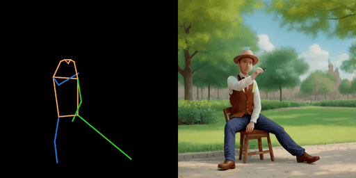</td>
  <td>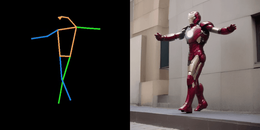</td>
  <tr>
  <td width=25% style="text-align:center;">"The man is sitting on chair, on the park"</td>
  <td width=25% style="text-align:center;">"The Iron man, on the street
"</td>
  <!-- <td width=25% style="text-align:center;">"Wonder Woman, wearing a cowboy hat, is skiing"</td>
  <td width=25% style="text-align:center;">"A man, wearing pink clothes, is skiing at sunset"</td> -->
</tr>
<td>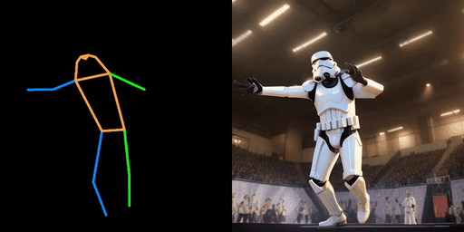</td>
<td>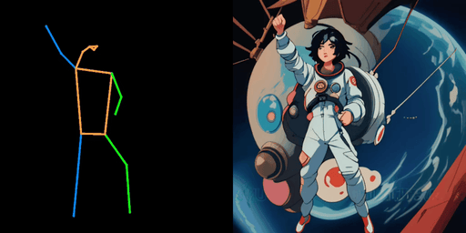</td>
<tr>
<td width=25% style="text-align:center;">"The stormtrooper, in the gym
"</td>
<td width=25% style="text-align:center;">"The astronaut, earth background, Cartoon Style
"</td>
</tr>
</table >

## 💃💃💃 Demo Video


https://github.com/mayuelala/FollowYourPose/assets/38033523/e021bce6-b9bd-474d-a35a-7ddff4ab8e75


## 💃💃💃 Abstract
<b>TL;DR: We tune the text-to-image model (e.g., stable diffusion) to generate the character videos from pose and text description.</b>

<details><summary>CLICK for full abstract</summary>


> Generating text-editable and pose-controllable character videos have an imperious demand in creating various digital human. Nevertheless, this task has been restricted by the absence of a comprehensive dataset featuring paired video-pose captions and the generative prior models for videos. In this work, we design a novel two-stage training scheme that can utilize easily obtained datasets (i.e., image pose pair and pose-free video) and the pre-trained text-to-image (T2I) model to obtain the pose-controllable character videos. Specifically, in the first stage, only the keypoint-image pairs are used only for a controllable textto-image generation. We learn a zero-initialized convolutional encoder to encode the pose information. In the second stage, we finetune the motion of the above network via a pose-free video dataset by adding the learnable temporal self-attention and reformed cross-frame self-attention blocks. Powered by our new designs, our method successfully generates continuously pose-controllable character videos while keeps the editing and concept composition ability of the pre-trained T2I model. The code and models will be made publicly available.
</details>

## 🕺🕺🕺 Changelog
<!-- A new option store all the attentions in hard disk, which require less ram. -->
- **[2023.08.30]** 🔥 Release some new results!
- **[2023.07.06]** 🔥 Release A new version of `浦源内容平台 demo` [](https://openxlab.org.cn/apps/detail/houshaowei/FollowYourPose)! Thanks for the support of Shanghai AI Lab!
- **[2023.04.12]** 🔥 Release local gradio demo and you could run it locally, only need a A100/3090. 
- **[2023.04.11]** 🔥 Release some cases in `huggingface demo`. 
- **[2023.04.10]** 🔥 Release A new version of `huggingface demo` [](https://huggingface.co/spaces/YueMafighting/FollowYourPose), which support both `raw video` and `skeleton video` as input. Enjoy it!
- **[2023.04.07]** Release the first version of  `huggingface demo`. Enjoy the fun of following your pose! You need to download the [skeleton video](https://github.com/mayuelala/FollowYourPose/tree/main/pose_example) or make your own skeleton video by [mmpose](https://mmpose.readthedocs.io/en/latest/model_zoo_papers/backbones.html#hrnet-cvpr-2019).  Additionaly, the second version which regard the `video format` as input is comming.
- **[2023.04.07]** Release a `colab notebook` [](https://colab.research.google.com/github/mayuelala/FollowYourPose/blob/main/quick_demo.ipynb) and updata the `requirements` for installation!
- **[2023.04.06]** Release `code`, `config` and `checkpoints`!
- **[2023.04.03]** Release Paper and Project page!

## 💃💃💃 HuggingFace Demo
<table class="center">
  <td></td>
  <td></td>
</tr>
</table>


## 🎤🎤🎤 Todo

- [X] Release the code, config and checkpoints for teaser
- [X] Colab
- [X] Hugging face gradio demo
- [ ] Release more applications


## 🍻🍻🍻 Setup Environment
Our method is trained using cuda11, accelerator and xformers on 8 A100.
``` 
conda create -n fupose python=3.8
conda activate fupose

pip install -r requirements.txt
``` 

`xformers` is recommended for A100 GPU to save memory and running time. 

<details><summary>Click for xformers installation </summary>

We find its installation not stable. You may try the following wheel:

```bash
wget https://github.com/ShivamShrirao/xformers-wheels/releases/download/4c06c79/xformers-0.0.15.dev0+4c06c79.d20221201-cp38-cp38-linux_x86_64.whl
pip install xformers-0.0.15.dev0+4c06c79.d20221201-cp38-cp38-linux_x86_64.whl
```
</details>

Our environment is similar to Tune-A-video ([official](https://github.com/showlab/Tune-A-Video), [unofficial](https://github.com/bryandlee/Tune-A-Video)). You may check them for more details.

## 💃💃💃 Training
We fix the bug in Tune-a-video and finetune stable diffusion-1.4 on 8 A100.
To fine-tune the text-to-image diffusion models for text-to-video generation, run this command:

```bash
TORCH_DISTRIBUTED_DEBUG=DETAIL accelerate launch \
    --multi_gpu --num_processes=8 --gpu_ids '0,1,2,3,4,5,6,7' \
    train_followyourpose.py \
    --config="configs/pose_train.yaml" 
```

## 🕺🕺🕺 Inference
Once the training is done, run inference:

```bash
TORCH_DISTRIBUTED_DEBUG=DETAIL accelerate launch \
    --gpu_ids '0' \
    txt2video.py \
    --config="configs/pose_sample.yaml" \
    --skeleton_path="./pose_example/vis_ikun_pose2.mov"
```
You could make the pose video by [mmpose](https://github.com/open-mmlab/mmpose) , we detect the skeleton by [HRNet](https://mmpose.readthedocs.io/en/latest/model_zoo_papers/backbones.html#hrnet-cvpr-2019).  You just need to run the video demo to obtain the pose video.  Remember to replace the background with black.


## 💃💃💃 Local Gradio Demo
You could run the gradio demo locally, only need a `A100/3090`.
```bash
python app.py
```
then the demo is running on local URL:  `http://0.0.0.0:Port`

## 🕺🕺🕺 Weight
[Stable Diffusion] [Stable Diffusion](https://arxiv.org/abs/2112.10752) is a latent text-to-image diffusion model capable of generating photo-realistic images given any text input. The pre-trained Stable Diffusion models can be downloaded from Hugging Face (e.g., [Stable Diffusion v1-4](https://huggingface.co/CompVis/stable-diffusion-v1-4))


[FollowYourPose] We also provide our pretrained checkpoints in [Huggingface](https://huggingface.co/YueMafighting/FollowYourPose_v1/tree/main). you could download them and put them into `checkpoints` folder to inference our models.


```bash
FollowYourPose
├── checkpoints
│   ├── followyourpose_checkpoint-1000
│   │   ├──...
│   ├── stable-diffusion-v1-4
│   │   ├──...
│   └── pose_encoder.pth
```


## 💃💃💃 Results
We show our results regarding various pose sequences and text prompts.

Note mp4 and gif files in this github page are compressed. 
Please check our [Project Page](https://follow-your-pose.github.io/) for mp4 files of original video results.
<table class="center">
<tr>
  <td>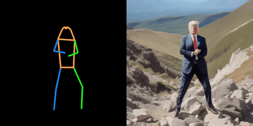</td>
  <td>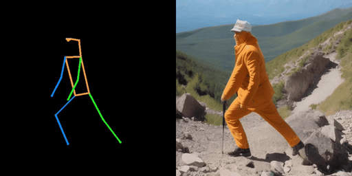</td>
  <td>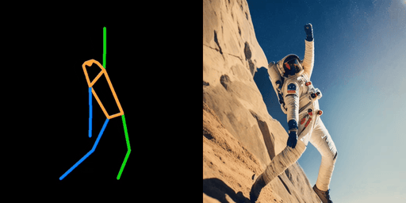</td>
</tr>
<tr>
  <td width=25% style="text-align:center;">"Trump, on the mountain
"</td>
  <td width=25% style="text-align:center;">"man, on the mountain
"</td>
  <td width=25% style="text-align:center;">"astronaut, on mountain"</td>
</tr>
</table>
<!--#########################################################-->
<table class="center">
<tr>
  <td>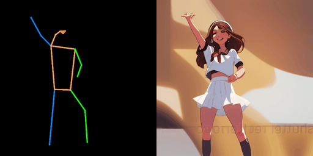</td>
  <td>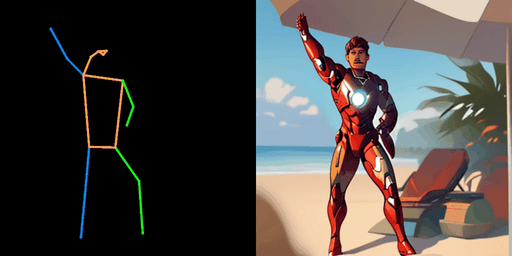</td>
  <td>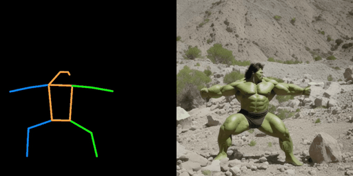</td>
</tr>
<tr>
  <td width=25% style="text-align:center;">"girl, simple background"</td>
  <td width=25% style="text-align:center;">"A Iron man, on the beach"</td>
  <td width=25% style="text-align:center;">"A Hulk, on the mountain"</td>
</tr>
</table>
<!--#########################################################-->

<table class="center">
<tr>
  <td>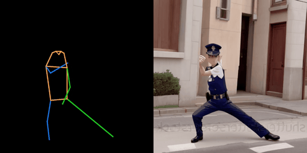</td>
  <td>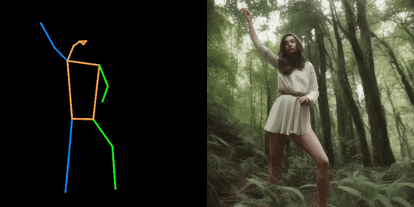</td>
  <td>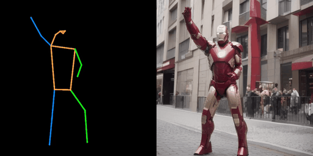</td>
</tr>
<tr>
  <td width=25% style="text-align:center;">"A policeman, on the street"</td>
  <td width=25% style="text-align:center;">"A girl, in the forest"</td>
  <td width=25% style="text-align:center;">"A Iron man, on the street"</td>
</tr>
</table>
<!--#########################################################-->
<table class="center">
<tr>
  <td></td>
  <td></td>
  <td></td>
</tr>
<tr>
  <td width=25% style="text-align:center;">"A Robot, in Sahara desert"</td>
  <td width=25% style="text-align:center;">"A Iron man, on the beach"</td>
  <td width=25% style="text-align:center;">"A panda, son the sea"</td>
</tr>
</table>
<!--#########################################################-->
<table class="center">
<tr>
  <td></td>
  <td></td>
  <td></td>
</tr>
<tr>
</tr>
<tr>
  <td width=25% style="text-align:center;">"A man in the park, Van Gogh style"</td>
  <td width=25% style="text-align:center;">"The fireman in the beach"</td>
  <td width=25% style="text-align:center;">"Batman, brown background"</td>
</tr>
</table>
<!--#########################################################-->


<table class="center">
<tr>
  <td></td>
  <td></td>
  <td></td>

</tr>
<tr>

</tr>
<tr>
  <td width=25% style="text-align:center;">"A Hulk, on the sea"</td>
  <td width=25% style="text-align:center;">"A superman, in the forest"</td>
  <td width=25% style="text-align:center;">"A Iron man, in the snow"</td>
</tr>
</table>
<!--#########################################################-->

<table class="center">
<tr>
  <td></td>
  <td></td>
  <td></td>

</tr>
<tr>

</tr>
<tr>
  <td width=25% style="text-align:center;">"A man in the forest, Minecraft."</td>
  <td width=25% style="text-align:center;">"A man in the sea, at sunset"</td>
  <td width=25% style="text-align:center;">"James Bond, grey simple background"</td>
</tr>
</table>
<!--#########################################################-->

<table class="center">
<tr>
  <td></td>
  <td></td>
  <td></td>

</tr>
<tr>

</tr>
<tr>
  <td width=25% style="text-align:center;">"A Panda on the sea."</td>
  <td width=25% style="text-align:center;">"A Stormtrooper on the sea"</td>
  <td width=25% style="text-align:center;">"A astronaut on the moon"</td>
</tr>
</table>
<!--#########################################################-->

<table class="center">
<tr>
  <td></td>
  <td></td>
  <td></td>

</tr>
<tr>

</tr>
<tr>
  <td width=25% style="text-align:center;">"A astronaut on the moon."</td>
  <td width=25% style="text-align:center;">"A Robot in Antarctica."</td>
  <td width=25% style="text-align:center;">"A Iron man on the beach."</td>
</tr>
</table>

<!--#########################################################-->
<table class="center">
<tr>
  <td></td>
  <td></td>
  <td></td>

</tr>
<tr>

</tr>
<tr>
  <td width=25% style="text-align:center;">"The Obama in the desert"</td>
  <td width=25% style="text-align:center;">"Astronaut on the beach."</td>
  <td width=25% style="text-align:center;">"Iron man on the snow"</td>
</tr>
</table>
<!--#########################################################-->

<table class="center">
<tr>
  <td></td>
  <td></td>
  <td></td>

</tr>
<tr>

</tr>
<tr>
  <td width=25% style="text-align:center;">"A Stormtrooper on the sea"</td>
  <td width=25% style="text-align:center;">"A Iron man on the beach."</td>
  <td width=25% style="text-align:center;">"A astronaut on the moon."</td>
</tr>
</table>
<!--#########################################################-->

<table class="center">
<tr>
  <td></td>
  <td></td>
  <td></td>

</tr>
<tr>

</tr>
<tr>
  <td width=25% style="text-align:center;">"Astronaut on the beach"</td>
  <td width=25% style="text-align:center;">"Superman on the forest"</td>
  <td width=25% style="text-align:center;">"Iron man on the beach"</td>
</tr>
</table>
<!--#########################################################-->

<table class="center">
<tr>
  <td></td>
  <td></td>
  <td></td>

</tr>
<tr>

</tr>
<tr>
  <td width=25% style="text-align:center;">"Astronaut on the beach"</td>
  <td width=25% style="text-align:center;">"Robot in Antarctica"</td>
  <td width=25% style="text-align:center;">"The Stormtroopers, on the beach"</td>
</tr>
</table>
<!--#########################################################-->


## 🎼🎼🎼 Citation 
If you think this project is helpful, please feel free to leave a star⭐️⭐️⭐️ and cite our paper:
```bibtex
@article{ma2023follow,
  title={Follow Your Pose: Pose-Guided Text-to-Video Generation using Pose-Free Videos},
  author={Ma, Yue and He, Yingqing and Cun, Xiaodong and Wang, Xintao and Shan, Ying and Li, Xiu and Chen, Qifeng},
  journal={arXiv preprint arXiv:2304.01186},
  year={2023}
}
``` 


## 👯👯👯 Acknowledgements

This repository borrows heavily from [Tune-A-Video](https://github.com/showlab/Tune-A-Video) and [FateZero](https://github.com/ChenyangQiQi/FateZero). thanks the authors for sharing their code and models.

## 🕺🕺🕺 Maintenance

This is the codebase for our research work. We are still working hard to update this repo and more details are coming in days. If you have any questions or ideas to discuss, feel free to contact [Yue Ma](mailto:y-ma21@mails.tsinghua.edu.cn) or [Yingqing He](https://github.com/YingqingHe) or [Xiaodong Cun](mailto:vinthony@gmail.com).

